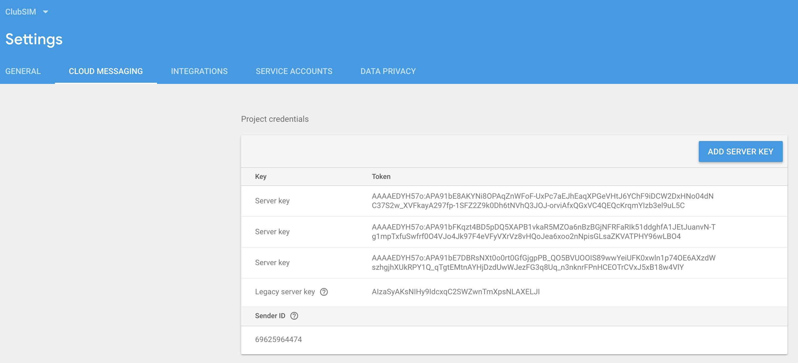
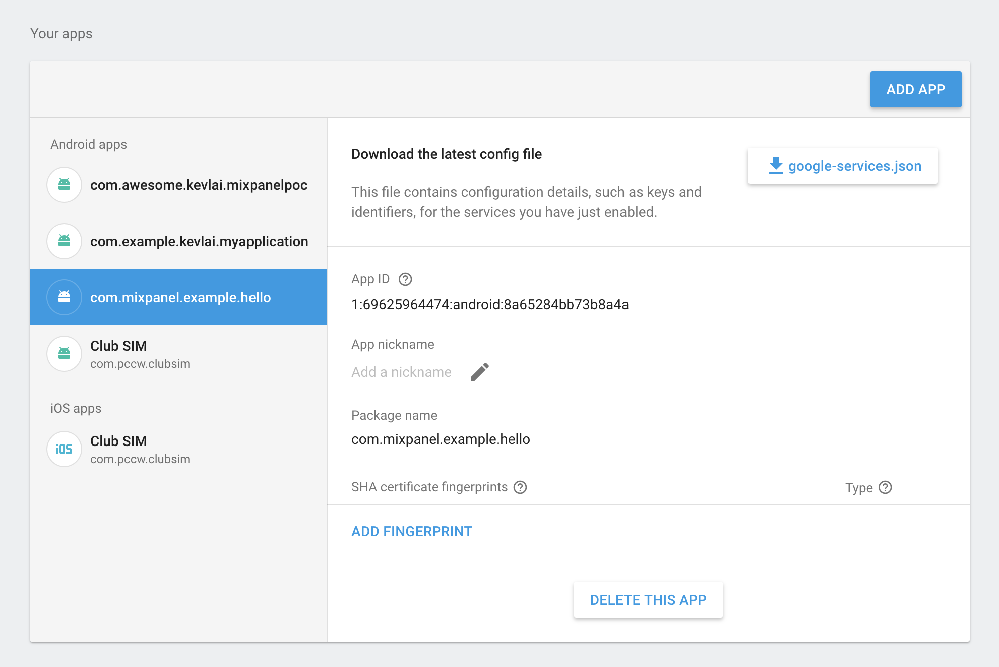

# Notes for MixPanel

## Changes
This app is basically a slight modification to your [example app](https://github.com/mixpanel/sample-android-mixpanel-integration), and here's the changes I've made:
- Import the project to Android Studio and let it make the necessary changes
- build.gradle is modified:
  - gradle version is bumped up to 3.1.2
  - inside `buildcript`, `jcenter()` is added to `repositories` to make the build work
  - `instrumentTest` is deprecated, I replaced it with `androidTest`
- Added `google-services.json` to the project
- The rest of the project are basically the same, except `MainActivity.java`:
  - the values for sender ID (for Firebase) and MixPanel API token are replaced with the right ones
  - Instead of executing your `getTrackingDistinctId` method to get a `trackingDistinctId`, I naively set it to `321` instead.

## Firebase
For your references, here are some screenshots I took from Firebase:

## Flow for Sending Messages
And here is a video showing the general steps I took to send messages on MixPanel, which was working fine:

[YouTube](https://www.youtube.com/watch?v=1kD5E-MloQI)

## A New Message replacing the Old Message Issue
And here is another video showing the old message is replaced whenever a new message is coming in:

[YouTube](https://youtu.be/RKEQ2cpnhUo )

Also notice there's no information about when a user receives that notification, unlike other notifications on the same panel. 

[Kev](kevlai22@uw.edu)

-------
Original Stuff on MixPanel repo

# Sample Android Application for Mixpanel Integration

This repository contains a sample application demonstrating how you
can use Mixpanel in your Android apps.

## Getting Started

The sample application can be build using either Android Studio or Eclipse.

### Using Android Studio
Integration in Android Studio is very simple.

- Clone this git repository (the instructions are at the top of the page)
- Within Android Studio, go to "File > Import Project"
- Select the directory you just cloned.
- When the gradle popup shows up, choose "use gradle default wrapper (recommended)" and click OK

You should now be able to run the sample application

### Using Eclipse
To import it into your workspace:

- Clone this git repository (the instructions are at the top of the page)
- Within Eclipse, go to "Import... > General > Existing Projects into Workspace"
- Select the directory you just cloned.

Next you'll need to import the mixpanel-android library and associate it as a dependency
(see http://mixpanel.com/help/reference/android#installing-eclipse for more details)

- Download and extract the latest release from https://github.com/mixpanel/mixpanel-android/releases/tag/latest
- Within Eclipse, go to "Import... > General > Existing Projects into Workspace"
- Select the directory you extract the latest release to.
- Within Eclipse, right click on the "sample-android-mixpanel-integration" project and choose "Properties"
- On the "Android" tab look for the "Libraries" section and click "Add"
- Choose the "mixpanel-android" library and click "OK"

You will also need to add your Mixpanel API token and your Android
Push Sender id to the source code, and enable Mixpanel to send Google
Cloud Messages on your behalf.

## Add your Mixpanel Token and Google Sender ID to the Source Code

There are two values in MainActivity.java that you'll need to update
before you can send data to Mixpanel and receive Google Cloud
Messaging notifications. You'll need to update the source code with
your Mixpanel API Token to send data, and your Google APIs Sender ID
to receive notifications.

### For Your Mixpanel Token

- Log in to your account at https://www.mixpanel.com
- Select the project you'll be working with from the drop-down at the top left
- Click the gear link at the bottom left to show the project settings dialog
- Copy the "Token" string from the dialog

Change the value of MainActivity.MIXPANEL_API_TOKEN to the value you
copied from the web page.

### For Your Google Sender ID

- Log in to your Google APIs Console at https://code.google.com/apis/console/
- Get the sender ID from the URL in your browser's address bar

Google API Console URLS look like this

    https://code.google.com/apis/console/#project:765432102468

Your sender ID will be the twelve digit number after '#project:'

Change the value of MainActivity.ANDROID_PUSH_SENDER_ID to the value you see in the URL.

## Set up Google Cloud Messaging services in Mixpanel

To send Google Cloud Messages, you will also have to connect Mixpanel
to your Google APIs account. To do this you'll need to make sure Cloud
Messaging is enabled, and provide an Google API key to Mixpanel

This process is documented in more detail, including screenshots, at

https://mixpanel.com/docs/people-analytics/android-push

### To Enable Google Cloud Messaging

- Log in to your Google APIs Console at https://code.google.com/apis/console/
- Click on "Services" on the left-hand navigation
- Scroll down to "Google Cloud Messaging for Android" and make sure the status switch shows "On"

### To Provide your Google API Key to Mixpanel

- Log in to your Google APIs Console at https://code.google.com/apis/console/
- Click on the "API Access"
- Click "Create new Server key...", and then click the "Create" button in the pop-up dialog
- Copy the new Google API key from the "Simple API Access" screen
- Log in to Mixpanel at http://www.mixpanel.com, and select the project associated with this application
- Click the gear icon in the lower left corner of the screen to show the project settings dialog
- Click on the Notifications tab of the project settings dialog
- Paste your Google API Key into the "Android GCM API Key" field

Once you've added your keys to the source code and set up Mixpanel to
send Google Cloud Messages, you're ready to build and deploy your application.

## Surveys
See http://mixpanel.com/help/reference/android#surveys

## Getting More Information

The Mixpanel Android integration API documentation is available on the Mixpanel website.

For an overview of Mixpanel Android library features
: https://mixpanel.com/help/reference/android

For details about setting up and implementing Google Cloud Messaging Notifications
: https://mixpanel.com/help/reference/android-push-notifications

For a detailed Android API reference
: http://mixpanel.github.io/mixpanel-android/index.html
